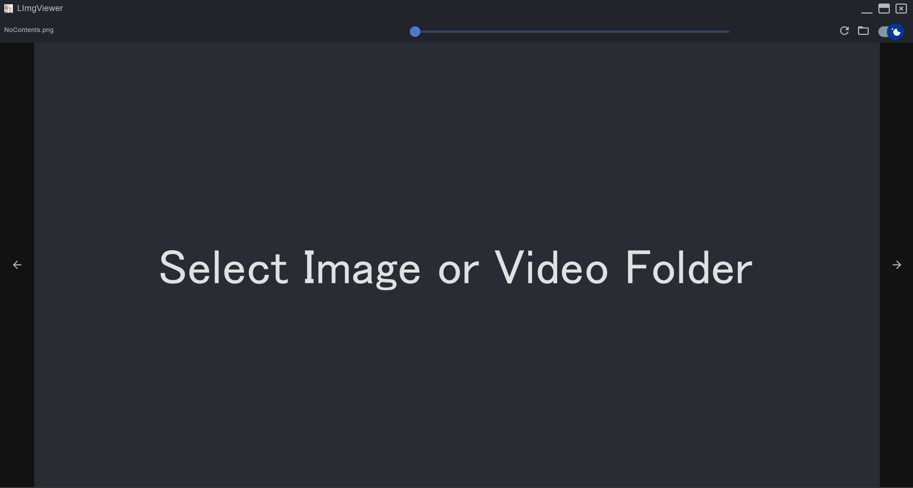

# LIMGViewer
 Image viewer



### Start
```
yarn
```
```
yarn start
```

### Key Board Short Cuts
* zoom in -> ;
* zoom out -> -
* rotate -> t
* reverse rotate -> ctrl + t
* horizontal flip -> f
* vertical flip -> ctrl + f
* move -> w or a or s or d
* next content -> right arrow
* prev content -> left arrow